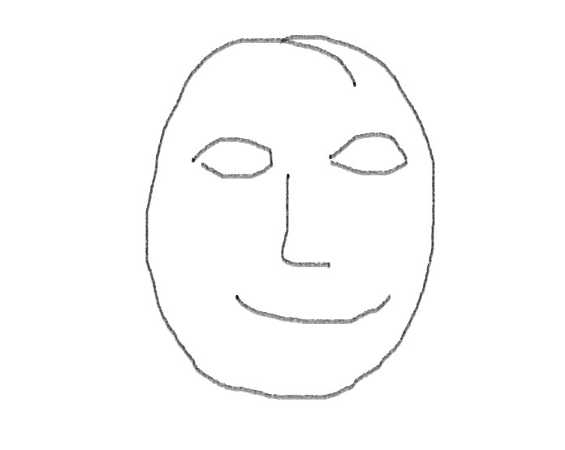
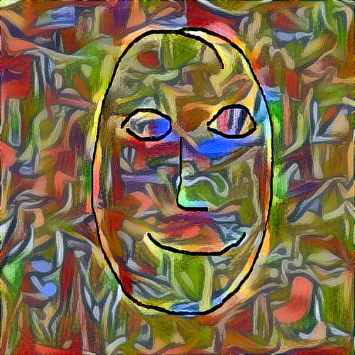
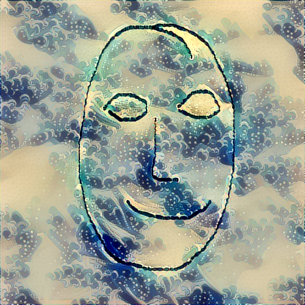
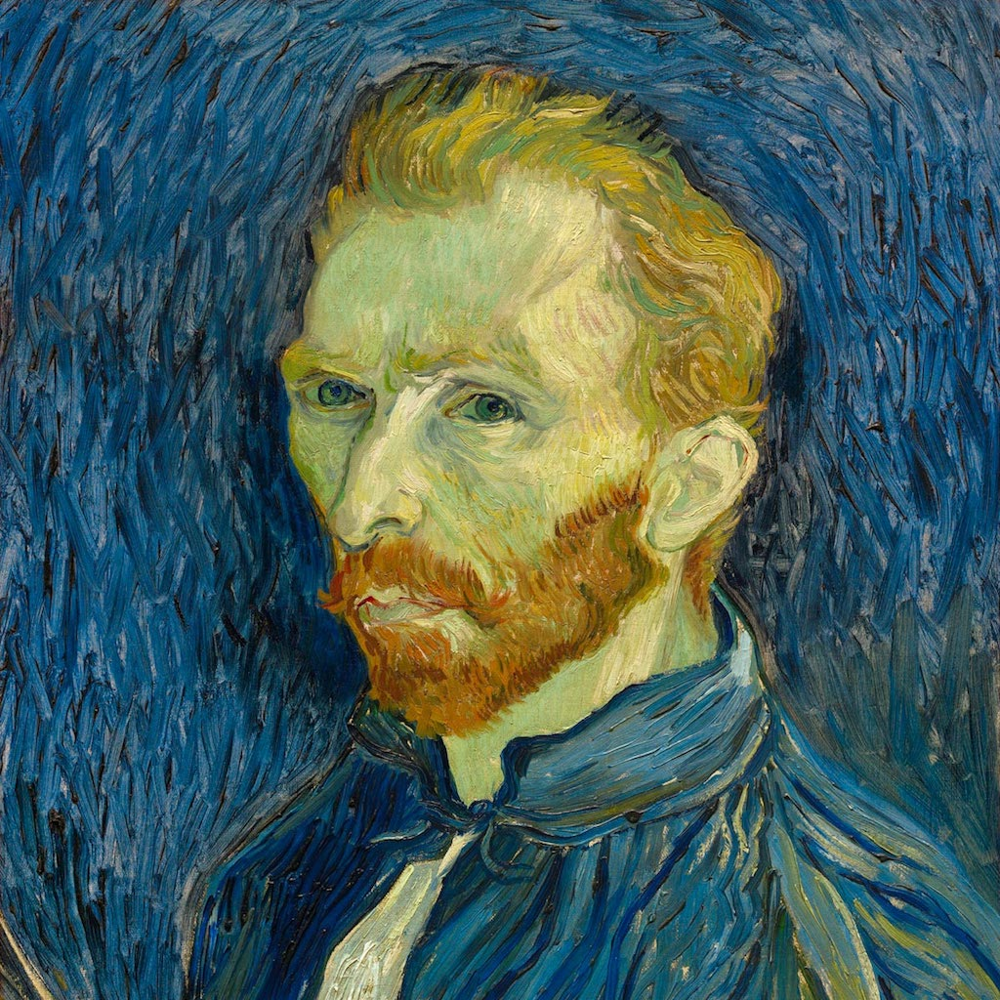
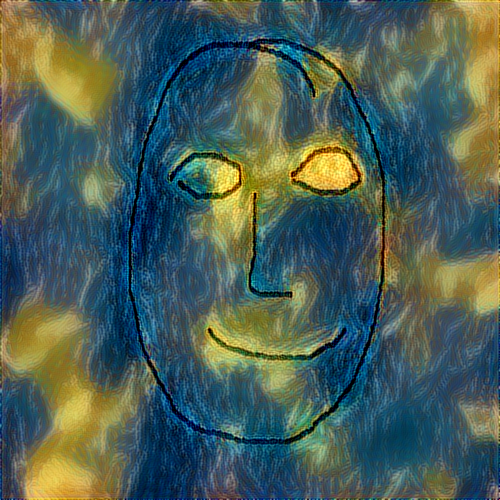
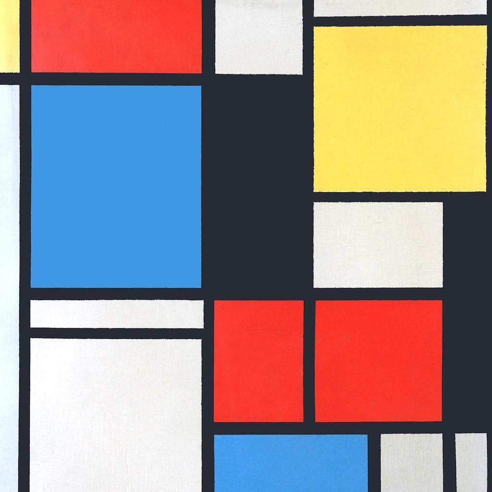
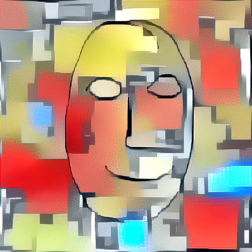
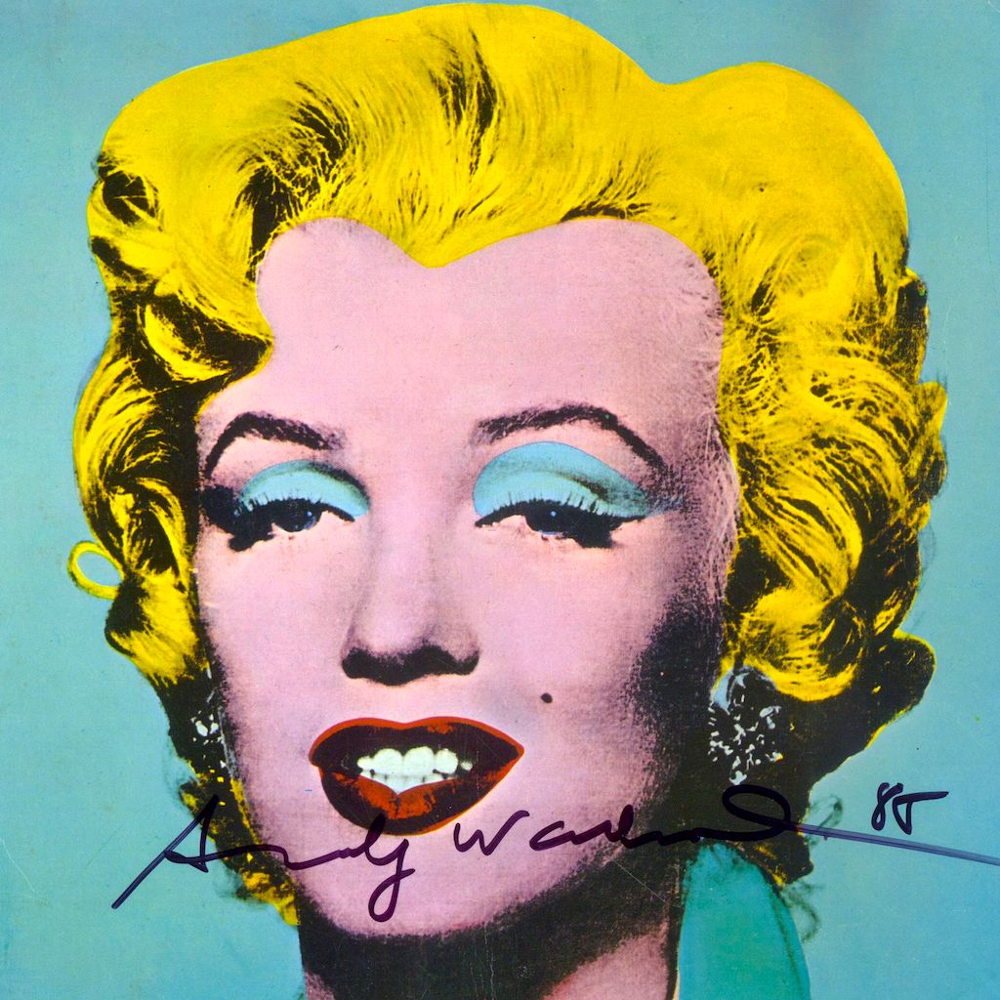
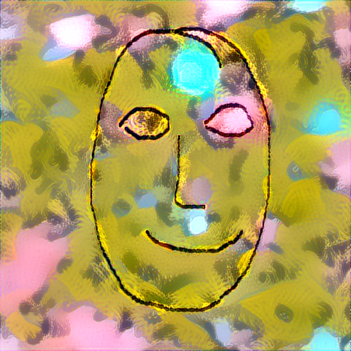

# AI Doodle

Based on [this video](https://www.youtube.com/watch?v=Oex0eWoU7AQ) by Siraj Raval and
corresponding [github](https://github.com/llSourcell/How-to-Generate-Art-Demo).

## Project goal
Project goal is to have a web application where user will be able to "doodle" something like 
in for example Windows Paint application and then upload the result to stylize what he has drawn
in a style of a selected artist.

## Example

Let's say user doodles something like this:

Then the result could be something like this:

Style | Result
------------ | -------------
 | 
 | 
 | 
 | 
 | 

# Produce results on floydhub

Modify the floyd_train.py file - set content image, style image and other parameters
and the run one of the following commands: 

* Run on CPU: floyd run --cpu --data monoton/datasets/ai_doodle/3:/data --env keras "python floyd_train.py"

* Run on GPU: floyd run --gpu --data monoton/datasets/ai_doodle/3:/data --env keras "python floyd_train.py"

# Possible setbacks

Producing new image based on style image and input is computationally expensive. For each of the 
upper examples computation lasted for around three minutes on a floydhub GPU device. Maybe we can get 
around this limitation by using web sockets and updating the result sequentially.
